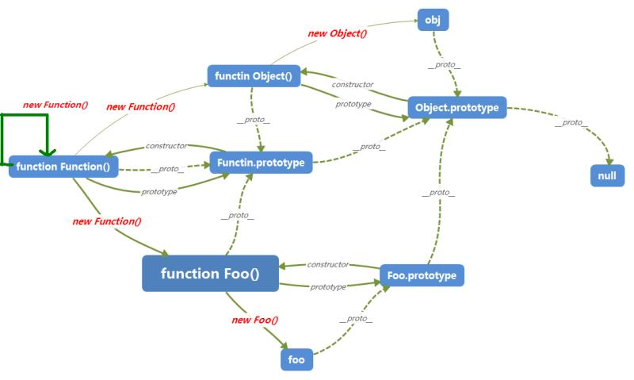
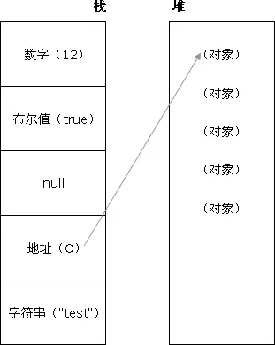

## 1.跨域的实现方法

#### CORS(Cross-Origin Resource Sharing，跨源资源共享)

使用自定义的HTTP 头部让浏览器与服务器进行沟通，从而决定请求或响应是应该成功，还是应该失败。

#### JSONP

通过script标签引入一个js文件，这个js文件载入成功后会执行我们在url参数中指定的函数，并且会把我们需要的json数据作为参数传入。所以jsonp是需要服务器端的页面进行相应的配合的。

#### document.domain

对于主域相同而子域不同的例子，可以通过设置document.domain的办法来解决。
具体的做法是可以在http://www.a.com/a.html 和http://script.a.com/b.html 两个文件中分别设置`document.domain = 'a.com'`，然后通过a.html文件中创建一个iframe，去控制iframe的contentDocument，这样两个js文件之间就可以“交互”了。

#### window.postMessage

允许两个窗口/帧之间跨域发送数据消息。从本质上讲，window.postMessage是一个跨域的无服务器垫片的Ajax。

#### window.name

window对象有个`name`属性，该属性有个特征：即在一个窗口(window)的生命周期内,窗口载入的所有的页面都是共享一个window.name的，每个页面对window.name都有读写的权限，window.name是持久存在一个窗口载入过的所有页面中的，并不会因新页面的载入而进行重置。

#### Websocket 

HTML5 的一个持久化的协议，它实现了浏览器与服务器的全双工通信，同时也是跨域的一种解决方案。

#### Node 中间件代理(两次跨域)

实现原理，同源策略是浏览器需要遵循的标准，而如果是服务器向服务器请求就无需遵循同源策略。

#### nginx 反向代理

实现原理类似于 Node 中间件代理，需要你搭建一个中转 nginx 服务器，用于转发请求。

### 详情请参考:

http://mp.weixin.qq.com/s/fDlyrRTv6zp-PQ1iRkTpBQ

https://mp.weixin.qq.com/s/LV7qziMyrMt0_EJWo05qkA

http://www.cnblogs.com/2050/p/3191744.html

http://www.cnblogs.com/yzg1/p/5070037.html

http://blog.csdn.net/joyhen/article/details/21631833

https://mp.weixin.qq.com/s/NOmsbKZsryTUONQj2gBFIA

## 2.jsonp的实现原理

#### 页面上 script 标签可以跨域，并且其 src 指定的js脚本到达浏览器会执行的特性，利用script标签的这一特性，将数据使用json格式用一个函数包裹起来，然后在进行访问的页面中定义一个相同函数名的函数，因为 script 标签src引用的js脚本到达浏览器时会执行，而我们有定义了一个同名的函数，所以json格式的数据，就做完参数传递给了我们定义的同名函数了。这样就完成了跨域数据交换。

### 详情请参考:

http://www.cnblogs.com/digdeep/p/4170059.html

## 3.jsonp优缺点

####   1.优点

1. 它不像XMLHttpRequest对象实现的Ajax请求那样受到同源策略的限制，JSONP可以跨越同源策略；
2. 它的兼容性更好，在更加古老的浏览器中都可以运行，不需要XMLHttpRequest或ActiveX的支持
3. 在请求完毕后可以通过调用callback的方式回传结果。将回调方法的权限给了调用方。这个就相当于将controller层和view层终于分开了。我提供的jsonp服务只提供纯服务的数据，至于提供服务以 后的页面渲染和后续view操作都由调用者来自己定义就好了。如果有两个页面需要渲染同一份数据，你们只需要有不同的渲染逻辑就可以了，逻辑都可以使用同 一个jsonp服务。

####  **2.缺点**

1. 它只支持GET请求而不支持POST等其它类型的HTTP请求
2. 它只支持跨域HTTP请求这种情况，不能解决不同域的两个页面之间如何进行JavaScript调用的问题。
3. jsonp在调用失败的时候不会返回各种HTTP状态码。
4. 缺点是安全性。万一假如提供jsonp的服务存在页面注入漏洞，即它返回的javascript的内容被人控制的。那么结果是什么？所有调用这个 jsonp的网站都会存在漏洞。于是无法把危险控制在一个域名下…所以在使用jsonp的时候必须要保证使用的jsonp服务必须是安全可信的。

## 4.ES6简介，箭头函数与function区别，promise的特点

### let, const

- 这两个的用途与`var`类似，都是用来声明变量的，但在实际运用中他俩都有各自的特殊用途。
- `let`则实际上为JavaScript新增了块级作用域。用它所声明的变量，只在`let`命令所在的代码块内有效，不允许在相同作用域内，重复声明同一个变量。
- `const`也用来声明变量，但是声明的是常量。一旦声明，常量的值就不能改变。
- `const`实际上保证的，并不是变量的值不得改动，而是变量指向的那个内存地址不得改动。对于简单类型的数据（数值、字符串、布尔值），值就保存在变量指向的那个内存地址，因此等同于常量。但对于复合类型的数据（主要是对象和数组），变量指向的内存地址，保存的只是一个指针，`const`只能保证这个指针是固定的，至于它指向的数据结构是不是可变的，就完全不能控制了。因此，将一个对象声明为常量必须非常小心。

#### 字符串的扩展

- 字符串的遍历器接口`for...of`循环遍历

  ```javascript
  for (let codePoint of 'foo') {
    console.log(codePoint)
  }
  ```

- **includes()**：返回布尔值，表示是否找到了参数字符串。

- **startsWith()**：返回布尔值，表示参数字符串是否在原字符串的头部。

- **endsWith()**：返回布尔值，表示参数字符串是否在原字符串的尾部。

- `repeat`方法返回一个新字符串，表示将原字符串重复`n`次。

- 模板字符串 

- ..................................................................等

#### 数组的扩展

- includes() 方法返回一个布尔值，表示某个数组是否包含给定的值
- `keys()`是对键名的遍历、`values()`是对键值的遍历，`entries()`是对键值对的遍历。
- `fill`方法使用给定值，填充一个数组。
- `find`方法，用于找出第一个符合条件的数组成员。它的参数是一个回调函数，所有数组成员依次执行该回调函数，直到找出第一个返回值为`true`的成员，然后返回该成员。如果没有符合条件的成员，则返回`undefined`。`findIndex`方法的用法与`find`方法非常类似，返回第一个符合条件的数组成员的位置，如果所有成员都不符合条件，则返回`-1`。
- `copyWithin`方法，在当前数组内部，将指定位置的成员复制到其他位置（会覆盖原有成员），然后返回当前数组。也就是说，使用这个方法，会修改当前数组。
- `Array.of`方法用于将一组值，转换为数组。
- `Array.from`方法用于将两类对象转为真正的数组：类似数组的对象（array-like object）和可遍历（iterable）的对象（包括ES6新增的数据结构Set和Map）。
- 扩展运算符（spread）是三个点（`...`）。它好比 rest 参数的逆运算，将一个数组转为用逗号分隔的参数序列。
- ..................................................................等

#### 函数的扩展

- 函数参数的默认值，直接写在参数定义的后面
- 函数的`length`属性，将返回没有指定默认值的参数个数。也就是说，指定了默认值后，`length`属性将失真。
- 参数的默认值，函数进行声明初始化时，参数会形成一个单独的作用域（context）。等到初始化结束，这个作用域就会消失。这种语法行为，在不设置参数默认值时，是不会出现的。
- rest 参数（形式为`...变量名`），用于获取函数的多余参数，这样就不需要使用`arguments`对象了。rest 参数搭配的变量是一个数组，该变量将多余的参数放入数组中。
- 箭头函数
  - 函数体内的`this`对象，就是定义时所在的对象，而不是使用时所在的对象。
  - 不可以当作构造函数，也就是说，不可以使用`new`命令，否则会抛出一个错误。
  - 不可以使用`arguments`对象，该对象在函数体内不存在。如果要用，可以用 rest 参数代替。
  - 不可以使用`yield`命令，因此箭头函数不能用作 Generator 函数。

#### 变量的解构赋值

从数组和对象中提取值，对变量进行赋值，这被称为解构（Destructuring）。

#### Symbol

- 通过`Symbol`函数生成。这就是说，对象的属性名现在可以有两种类型，一种是原来就有的字符串，另一种就是新增的 Symbol 类型。凡是属性名属于 Symbol 类型，就都是独一无二的，可以保证不会与其他属性名产生冲突。
- `Symbol`函数前不能使用`new`命令，否则会报错。这是因为生成的 Symbol 是一个原始类型的值，不是对象。也就是说，由于 Symbol 值不是对象，所以不能添加属性。基本上，它是一种类似于字符串的数据类型。
- `Symbol`函数可以接受一个字符串作为参数，表示对 Symbol 实例的描述，主要是为了在控制台显示，或者转为字符串时，比较容易区分。

#### Set 和 Map 数据结构

- set类似于数组，但是成员的值都是唯一的，没有重复的值。Set 本身是一个构造函数，用来生成 Set 数据结构。
- Map 类似于对象，也是键值对的集合，但是“键”的范围不限于字符串，各种类型的值（包括对象）都可以当作键。也就是说，Object 结构提供了“字符串—值”的对应，Map结构提供了“值—值”的对应，是一种更完善的 Hash 结构实现。如果你需要“键值对”的数据结构，Map 比 Object 更合适。

## Promise

- Promise 是异步编程的一种解决方案，比传统的解决方案——回调函数和事件——更合理和更强大。它由社区最早提出和实现，ES6 将其写进了语言标准，统一了用法，原生提供了`Promise`对象。

- 简单说就是一个容器，里面保存着某个未来才会结束的事件（通常是一个异步操作）的结果。从语法上说，Promise 是一个对象，从它可以获取异步操作的消息。Promise 提供统一的 API，各种异步操作都可以用同样的方法进行处理。

- `Promise`对象有以下两个特点。

  （1）对象的状态不受外界影响。`Promise`对象代表一个异步操作，有三种状态：`Pending`（进行中）、`Fulfilled`（已成功）和`Rejected`（已失败）。只有异步操作的结果，可以决定当前是哪一种状态，任何其他操作都无法改变这个状态。这也是`Promise`这个名字的由来，它的英语意思就是“承诺”，表示其他手段无法改变。

  （2）一旦状态改变，就不会再变，任何时候都可以得到这个结果。`Promise`对象的状态改变，只有两种可能：从`Pending`变为`Fulfiled`和从`Pending`变为`Rejected`。只要这两种情况发生，状态就凝固了，不会再变了，会一直保持这个结果，这时就称为 Resolved（已定型）。如果改变已经发生了，你再对`Promise`对象添加回调函数，也会立即得到这个结果。这与事件（Event）完全不同，事件的特点是，如果你错过了它，再去监听，是得不到结果的。

## class

`class`可以看作只是一个语法糖，它的绝大部分功能，ES5 都可以做到，新的`class`写法只是让对象原型的写法更加清晰、更像面向对象编程的语法而已。

#### module

 模块的设计思想，是尽量的静态化，使得编译时就能确定模块的依赖关系，以及输入和输出的变量。

### 详情请参考:

http://es6.ruanyifeng.com/

## 5.邮箱的正则表达式

```jsx
/^[a-zA-Z0-9_-]+@[a-zA-Z0-9_-]+(\.[a-zA-Z0-9_-]+)+$/		
/*只允许英文字母、数字、下划线、英文句号、以及中划线组成*/
/^[A-Za-z0-9\u4e00-\u9fa5]+@[a-zA-Z0-9_-]+(\.[a-zA-Z0-9_-]+)+$/	
/*名称允许汉字、字母、数字，域名只允许英文域名*/
```
## 6.事件委托

- 事件委托就是利用事件冒泡，只指定一个事件处理程序，就可以管理某一类型的所有事件。
- JavaScript中，添加到页面上的事件处理程序数量将直接关系到页面的整体运行性能，因为需要不断的与dom节点进行交互，访问dom的次数越多，引起浏览器重绘与重排的次数也就越多，就会延长整个页面的交互就绪时间，这就是为什么性能优化的主要思想之一就是减少DOM操作的原因；如果要用事件委托，就会将所有的操作放到js程序里面，与dom的操作就只需要交互一次，这样就能大大的减少与dom的交互次数，提高性能；

### 详情请参考:

http://www.cnblogs.com/leejersey/p/3801452.html

## 7.数组的方法

```javascript
var	arr1=[4,5,2,6,3];
var	arr2=[9,7,0,9];
arr1.concat(arr2);					//两个数组组合拼接
var str=arr1.join("-");			//用符号-连接数组每一项，得到字符串
str.split("-");					//把字符串中-每一段，分为数组每一项
arr1.reverse();					//倒序排列数组
function reFn(a,b){
  return (a-b);
}
arr1.sort(reFn);				//从小到大排序
arr1.splice(0,2,3,4);			//从索引0开始删除2个，再在删除的地方插入3,4，此方法会修改原数组
arr1.slice(0,2);				//从索引0开始，截取到索引2，[0,2)能取到0，取不到2
arr1.push(1);					//从数组arr1后面添加一项
arr1.pop();						//从数组arr1后面删除一项
arr1.unshift(1);				//从数组arr1前面添加一项
arr1.shift();					//从数组arr1前面删除一项
arr1.indexOf(2);				//从数组arr1中查找2，返回第一个2的索引，没有则返回-1
arr1.indexOf(2,1);				//从数组arr1中索引1开始查找2，返回第一个2的索引，没有则返回-1
arr1.lastIndexOf(2);			//从数组arr1中最后面开始查找2，返回第一个2的索引，没有则返回-1
arr1.findIndex(function(x) {
  return (x == 2);
});							//2	返回第一个符合条件的数组成员的位置
arr1.findIndex(function(value, index, arr) {  
	return value > 5;  
})							 // 3  返回第一个符合条件的数组成员的位置
var arrNew=arr1.filter(function(el,index,arr){
  	if(el>4){
      return false;
  	}
  	return true;
});								//数组筛选，返回true的保留
arr1.forEach(function(el,index,arr){
  	console.log(el);
});								//数组遍历
var arrNew = arr1.map((currentValue, index, array) => {
    console.log(`currentValue = `, currentValue);
    console.log(`index = `, index);
    console.log(`array= `, array);
    return currentValue * 2;
}, arr1);	//对数组每一项进行遍历操作，最后一个参数arr1（可选），表示回调函数中this指向
arr1.find((n) => n < 4);		//2	 找出第一个符合条件的数组成员
arr1.find(function(value, index, arr) {  
	return value >4;  
}) // 5   找出第一个符合条件的数组成员
arr1.every(function(e){
  return (e>5);
});		//false  检测数组所有元素是否都符合指定条件
arr1.some(function(e){
  return (e>5);
});		//true  用于检测数组中的元素是否满足指定条件,有一个就可以
```

## 8.字符串方法

```javascript
var str="hello world";
str.slice(4,7);             //o w  起始位置和结束位置(不包括结束位置)
str.substring(4,7);         //o w	起始位置和结束位置(不包括结束位置)
str.substring(7,4);         //o w	较小的为起始位置，较大的为结束位置
str.substr(4,7);            //o world  起始位置和所要返回的字符串长度
str.search('ll');			//2	检索字符串中指定的子字符串，或检索与正则表达式相匹配的子字符串
//--------------------------------------------
str.slice(-3);              //rld	将它字符串的长度与对应的负数相加，结果作为参数
str.slice(3,-4);       		//lo w 将它字符串的长度与对应的负数相加，结果作为参数

str.substring(-3);     		//hello world	将负参数都直接转换为0
str.substring(3,-4);   		//hel	将负参数都直接转换为0

str.substr(-3);        		//rld	将第一个参数与字符串长度相加后的结果作为第一个参数
str.substr(3,-4);      		//空字符串	将第一个参数与字符串长度相加后的结果作为第一个参数
//-----------------------------------------------------------------
str.indexOf("e");			//1 第一个匹配的字符串索引位置
str.replace("o","!");		//只会替换第一个匹配的o字符串替换为！
str.replace(/o/g,"!");		//替换所有匹配的o字符串替换为！
str.charAt(2);				//l 指定索引位置2处的字符
var str2=str.toUpperCase();	//HELL0 WORLD 变成大写字符串
str2.toLowerCase();			//hello world 变成小写字符串
```

## 9.fetch请求超时处理

```javascript
//方法一：单纯setTimeout方式
var oldFetchfn = fetch; //拦截原始的fetch方法
window.fetch = function(input, opts){//定义新的fetch方法，封装原有的fetch方法
    return new Promise(function(resolve, reject){
        var timeoutId = setTimeout(function(){
            reject(new Error("fetch timeout"))
        }, opts.timeout);
        oldFetchfn(input, opts).then(
            res=>{
                clearTimeout(timeoutId);
                resolve(res)
            },
            err=>{
                clearTimeout(timeoutId);
                reject(err)
            }
        )
    })
}
//方法二：利用Promise.race方法
var oldFetchfn = fetch; //拦截原始的fetch方法
window.fetch = function(input, opts){//定义新的fetch方法，封装原有的fetch方法
    var fetchPromise = oldFetchfn(input, opts);
    var timeoutPromise = new Promise(function(resolve, reject){
        setTimeout(()=>{
             reject(new Error("fetch timeout"))
        }, opts.timeout)
    });
    retrun Promise.race([fetchPromise, timeoutPromise])
}
```

### 详情请参考:

http://www.cnblogs.com/huilixieqi/p/6494380.html

## 10.下面执行结果

```javascript
var num = +{
  name:'ls',
  age:13,
  sayHello:function(){
    console.log(this.name+'----'+this.age)
  }
}
console.log(num)
```

#### 结果：NAN

## 11.js闭包的理解

- #### 闭包就是能够读取其他函数内部变量的函数。

- #### 闭包的用途

  一个是前面提到的可以读取函数内部的变量，另一个就是让这些变量的值始终保持在内存中。

  减少全局变量，减少传递函数的参数量，封装；

- #### **闭包的注意点**

  - 由于闭包会使得函数中的变量都被保存在内存中，内存消耗很大，所以不能滥用闭包，否则会造成网页的性能问题，在IE中可能导致内存泄露。解决方法是，在退出函数之前，将不使用的局部变量全部删除。
  - 闭包会在父函数外部，改变父函数内部变量的值。所以，如果你把父函数当作对象（object）使用，把闭包当作它的公用方法（Public Method），把内部变量当作它的私有属性（private value），这时一定要小心，不要随便改变父函数内部变量的值。

```
function closure(){
  var num = 1;
  return function inner(){
    console.log(num++);
  }
}  // 简单闭包示例
```

- 特性
  - 函数嵌套函数
  - 封闭性：外界无法访问闭包内部的数据，如果在闭包内声明变量，外界是无法访问的，除非闭包主动向外界提供访问接口； 
  - 持久性：一般的函数，调用完毕之后，系统自动注销函数，而对于闭包来说，在外部函数被调用之后，闭包结构依然保存在。

### 详情请参考:

http://www.cnblogs.com/wangfupeng1988/p/3994065.html

http://www.ruanyifeng.com/blog/2009/08/learning_javascript_closures.html

http://www.cnblogs.com/yunfeifei/p/4019504.html

## 12.this的指向问题

- #### 1.方法调用模式 

  当一个函数被保存为对象的一个属性时, 我们称它为一个方法, 当一个方法被调用时, this指向该对象

- #### 2.函数调用模式 （或全局）

  当一个函数并非一个对象的属性时, 它被当作一个函数来调用, 此时的this指向全局对象(window)

- #### 3.构造器调用模式

  结合new前缀调用的函数被称为构造器函数, 此时的this指向该构造器函数的实例对象

- #### 4.apply/call调用模式

  apply和call方法可以让我们设定调用者中的this指向谁

### 详情请参考:

http://blog.csdn.net/babybk/article/details/51272790

https://blog.csdn.net/qq_37467034/article/details/78311591

## 13.定时器里面this指向问题

- #### setTimeout函数中的this会指向window对象

```jsx
var num = 0;
function Obj (){
    this.num = 1,
    this.getNum = function(){
        console.log(this.num);
    },
    this.getNumLater = function(){
        setTimeout(function(){
            console.log(this.num);
        }, 1000)
    }
}
var obj = new Obj; 
obj.getNum();//1　　打印的是obj.num，值为1
obj.getNumLater()//0　　打印的是window.num，值为0
```

从上述例子中可以看到setTimeout中函数内的this是指向了window对象，这是由于`setTimeout()调用的代码运行在与所在函数`完全分离的执行环境上。这会导致这些代码中包含的 `this` 关键字会指向 `window` (或`全局`)对象

- #### setTimeout(this.method, time)这种形式中的this，即上文中提到的第一个this，是根据上下文来判断的，默认为全局作用域，但不一定总是处于全局下，具体问题具体分析。

  ```jsx
  var value=33;
  function Foo() {
      this.value = 42;
      this.method = function() {
          // this 指向全局对象
          alert(this)   // 输出window    第二个this
          alert(this.value); // 输出：33   第二个this
      };
      setTimeout(this.method, 500);  // 这里的this指向Foo的实例对象  第一个this
  }
  new Foo();
  ```

- #### 利用bind()方法

  ```jsx
  var num = 0;
  function Obj (){
      this.num = 1,
      this.getNum = function(){
          console.log(this.num);
      },
      this.getNumLater = function(){
          setTimeout(function(){
              console.log(this.num);
          }.bind(this), 1000)    //利用bind()将this绑定到这个函数上
      }
  }
  var obj = new Obj; 
  obj.getNum();//1　　打印的为obj.num，值为1
  obj.getNumLater()//1　　打印的为obj.num，值为1
  ```

bind()方法是在Function.prototype上的一个方法，当被绑定函数执行时，bind方法会创建一个新函数，并将第一个参数作为新函数运行时的this。在这个例子中，在调用setTimeout中的函数时，bind方法创建了一个新的函数，并将this传进新的函数，执行的结果也就是正确的了。

- #### 箭头函数

  ```jsx
  var num = 0;
  function Obj (){
      this.num = 1,
      this.getNum = function(){
          console.log(this.num);
      },
      this.getNumLater = function(){
          setTimeout(() => {
              console.log(this.num);
          }, 1000)    //箭头函数中的this总是指向外层调用者，也就是Obj
      }
  }
  var obj = new Obj; 
  obj.getNum();//1　　打印的是obj.num，值为1
  obj.getNumLater()//1　　打印的是obj.num，值为1
  ```

箭头函数有几个使用注意点。

（1）函数体内的`this`对象，就是定义时所在的对象，而不是使用时所在的对象。

（2）不可以当作构造函数，也就是说，不可以使用`new`命令，否则会抛出一个错误。

（3）不可以使用`arguments`对象，该对象在函数体内不存在。如果要用，可以用 rest 参数代替。

（4）不可以使用`yield`命令，因此箭头函数不能用作 Generator 函数。

### 详情请参考:

http://www.cnblogs.com/zsqos/p/6188835.html

http://es6.ruanyifeng.com/#docs/function#%E7%AE%AD%E5%A4%B4%E5%87%BD%E6%95%B0

## 14.js框架封装

#### 模拟jQuery框架，利用原生的js技术，封装一个js框架，以加深对jQuery的常用api的使用和面向对象原理的理解；

#### 一：结构部分

首先利用闭包，构造一个自执行函数，然后利用选择器函数Sizzle，获取dom元素；其后设置入口函数jQuery，返回一个F的实例；
然后对jQuery.prototype进行设置；其后修改F的原型指向jQuery的原型,最后暴露出去两个接口$和jQuery；

#### 二：jQuery.fn.extend = jQuery.extend = function(){}

通过向jQuery的原型和jQuery上添加一个extend方法；
可以实现扩展工具类方法和dom操作、css操作类的方法；
jQuery.fn.extend(object); 对jQuery.fn即jQuery.prototype
得扩展，就是为jQuery类添加“成员函数”。jQuery类的实例可以使用这个“成员函数”。

### 详情请参考:

http://www.cnblogs.com/marsqi/p/6280429.html

## 15.ajax状态码

#### Ajax状态值与状态码区别

- AJAX状态值是指，运行Ajax所经历过的几种状态，无论访问是否成功都将响应的步骤，可以理解成为AJAX运行步骤。如：正在发送，正在响应等，由AJAX对象与服务器交互时所得；使用“ajax.readyState”获得。（由数字1~4单位数字组成） 

- AJAX状态码是指，无论AJAX访问是否成功，由HTTP协议根据所提交的信息，服务器所返回的HTTP头信息代码，该信息使用“ajax.status”所获得；（由数字1XX,2XX三位数字组成，详细查看RFC）

#### Ajax运行步骤与状态值说明

在AJAX实际运行当中，对于访问XMLHttpRequest（XHR）时并不是一次完成的，而是分别经历了多种状态后取得的结果，对于这种状态在AJAX中共有5种，分别是: 

- 0 - (未初始化)还没有调用send()方法
- 1 - (载入)已调用send()方法，正在发送请求 
- 2 - (载入完成)send()方法执行完成
- 3 - (交互)正在解析响应内容 
- 4 - (完成)响应内容解析完成，可以在客户端调用了 

对于上面的状态，其中“0”状态是在定义后自动具有的状态值，而对于成功访问的状态（得到信息）我们大多数采用“4”进行判断

#### Ajax状态码说明

- 1**	请求收到，继续处理
- 2**	操作成功收到，分析、接受
- 3**	完成此请求必须进一步处理
- 4**	请求包含一个错误语法或不能完成
- 5**	服务器执行一个完全有效请求失败
- 100	客户必须继续发出请求
- 101	客户要求服务器根据请求转换HTTP协议版本
- 200	交易成功
- 201	提示知道新文件的URL
- 202	接受和处理、但处理未完成
- 203	返回信息不确定或不完整
- 204	请求收到，但返回信息为空
- 205	服务器完成了请求，用户代理必须复位当前已经浏览过的文件
- 206	服务器已经完成了部分用户的GET请求
- 300	请求的资源可在多处得到
- 301	删除请求数据
- 302	在其他地址发现了请求数据
- 303	建议客户访问其他URL或访问方式
- 304	客户端已经执行了GET，但文件未变化
- 305	请求的资源必须从服务器指定的地址得到
- 306	前一版本HTTP中使用的代码，现行版本中不再使用
- 307	申明请求的资源临时性删除
- 400	错误请求，如语法错误
- 401	请求授权失败
- 402	保留有效ChargeTo头响应
- 403	请求不允许
- 404	没有发现文件、查询或URl
- 405	用户在Request-Line字段定义的方法不允许
- 406	根据用户发送的Accept拖，请求资源不可访问
- 407	类似401，用户必须首先在代理服务器上得到授权
- 408	客户端没有在用户指定的饿时间内完成请求
- 409	对当前资源状态，请求不能完成
- 410	服务器上不再有此资源且无进一步的参考地址
- 411	服务器拒绝用户定义的Content-Length属性请求
- 412	一个或多个请求头字段在当前请求中错误
- 413	请求的资源大于服务器允许的大小
- 414	请求的资源URL长于服务器允许的长度
- 415	请求资源不支持请求项目格式
- 416	请求中包含Range请求头字段，在当前请求资源范围内没有range指示值，请求也不包含If-Range请求头字段
- 417	服务器不满足请求Expect头字段指定的期望值，如果是代理服务器，可能是下一级服务器不能满足请求
- 500	服务器产生内部错误
- 501	服务器不支持请求的函数
- 502	服务器暂时不可用，有时是为了防止发生系统过载
- 503	服务器过载或暂停维修，宕机
- 504	关口过载，服务器使用另一个关口或服务来响应用户，等待时间设定值较长
- 505	服务器不支持或拒绝支请求头中指定的HTTP版本

### 详情请参考:

https://blog.csdn.net/qq_29627497/article/details/82027376

## 16.盒子拖拽

```html
<!DOCTYPE html>
<html>
    <head>
        <meta charset="UTF-8">
        <title></title>
        <style type="text/css">
            #box{
                width: 200px;
                height: 200px;
                background: lightskyblue;
                position: absolute;
            }
        </style>
        <script type="text/javascript">
            window.onload=function(){
                var oBox=document.getElementById('box');

                var disx=0; //鼠标按住盒子box后,相对box的水平坐标，初始化
                var disy=0;

                oBox.onmousedown=function(ev){
                    var oEvent=ev||event;
                    disx=oEvent.clientX-oBox.offsetLeft;
                    disy=oEvent.clientY-oBox.offsetTop;

                    //不能用oBox.onmousemove=function(ev){}  
                    //oBox的作用域相对document小，一旦鼠标拖拽速度很快,鼠标指针从盒子内部“甩出”，盒子就不会随着鼠标走
                    document.onmousemove=function(ev){
                        var oEvent=ev||event;
//++++++++++++++++++++++++++++++++++++++++++++++++++++++++++++++
                        //  加入下面这段，实现了， 鼠标拖拽盒子，不会出现，把盒子，甩出可视区域。
                        var oLeft=oEvent.clientX-disx;
                        var oTop=oEvent.clientY-disy;

                        if(oLeft<0){
                            oLeft=0;
                        }
                        //不能写else else不能判断，else后面是直接跟着{}，{}里面写结果
                        //else if(){}用于多条件判断
                        else if(oLeft>document.documentElement.clientWidth-oBox.offsetWidth){
                            oLeft=document.documentElement.clientWidth-oBox.offsetWidth;
                        }

                        if(oTop<0){
                            oTop=0;
                        }
                        //不能写else else不能判断，else后面是直接跟着{}，{}里面写结果
                        //else if(){}用于多条件判断
                        else if(oTop>document.documentElement.clientHeight-oBox.offsetHeight){
                            oTop=document.documentElement.clientHeight-oBox.offsetHeight;
                        }

                        oBox.style.left=oLeft+'px';
                        oBox.style.top=oTop+'px';
//++++++++++++++++++++++++++++++++++++++++++++++++++++++++++++                      //oBox.style.left=oEvent.clientX-disx+'px';
                        //oBox.style.top=oEvent.clientY-disy+'px';

                    };
                    //不能用oBox.onmousemove=function(ev)  
                    //oBox的作用域相对document小，一旦鼠标拖拽速度很快，盒子就不会随着鼠标走
                    document.onmouseup=function(){
                        // 松开鼠标按键后，盒子不会再动。
                        document.onmousedown=null;
                        document.onmousemove=null;
                    };

                    return false; // 针对 火狐低版本的 二次拖拽出现的鬼影 。（但现在浏览器高版本，可能没有这个bug了。）
                };                                              
            };
        </script>
    </head>
    <body>
        <div id="box"></div>
    </body>
</html>
```

### 详情请参考:

https://blog.csdn.net/ljs_cn/article/details/52812456

#### 另一种拖拽

```html
<!DOCTYPE html>
<html lang="en">
<head>
    <meta charset="UTF-8">
    <title>Title</title>
    <style>
        *{
            margin: 0;
            padding: 0;
        }
        .div1{
            width: 200px;
            height: 200px;
            border: 1px solid red;
            position: relative;
            margin-left:20px;
            float: left;
        }
        .div2{
            width: 200px;
            height: 200px;
            border: 1px solid blue;
            position: relative;
            margin-left:20px;
            float: left;
        }
        .div3{
            width: 200px;
            height: 200px;
            border: 1px solid green;
            position: relative;
            margin-left:20px;
            float: left;
        }
        p{
            background-color: orange;
            margin-top: 5px;
        }
    </style>
</head>
<body>
<div class="div1" id="div1">
    <!--在h5中，如果想拖拽元素，就必须为元素添加draggable="true". 图片和超链接默认就可以拖拽-->
    <p id="pe" draggable="true">试着把我拖过去</p>
    <p id="pe1" draggable="true">试着也把我拖过去</p>
</div>
<div class="div2" id="div2"></div>
<div class="div3" id="div3"></div>
<script>
    /*学习拖拽，主要就是学习拖拽事件*/
    var obj=null;//当前被拖拽的地元素

    /*应用于被拖拽元素的事件
    *ondrag         应用于拖拽元素，整个拖拽过程都会调用--持续
     ondragstart    应用于拖拽元素，当拖拽开始时调用
     ondragleave    应用于拖拽元素，当鼠标离开拖拽元素时调用
     ondragend    应用于拖拽元素，当拖拽结束时调用*/
    document.ondragstart=function(e){
        /*通过事件捕获来获取当前被拖拽的子元素*/
        e.target.style.opacity=0.5;
        e.target.parentNode.style.borderWidth="5px";
        obj= e.target;
        /*通过dataTransfer来实现数据的存储与获取
        * setData(format,data):
        * format:数据的类型：text/html   text/uri-list
        * Data:数据:一般来说是字符串值*/
        e.dataTransfer.setData("text/html", e.target.id);
    }
    document.ondragend=function(e){
        e.target.style.opacity=1;
        e.target.parentNode.style.borderWidth="1px";
    }
    document.ondragleave=function(e){
    }
    document.ondrag=function(e){
    }

    /*应用于目标元素的事件
    *ondragenter    应用于目标元素，当拖拽元素进入时调用
     ondragover    应用于目标元素，当停留在目标元素上时调用
     ondrop        应用于目标元素，当在目标元素上松开鼠标时调用
     ondragleave    应用于目标元素，当鼠标离开目标元素时调用*/
    document.ondragenter=function(e){
        console.log(e.target);
    }
    document.ondragover=function(e){
        /*如果想触发ondrop事件，那么就必须在这个位置阻止浏览器的默认行为*/
        e.preventDefault();
    }
    /*浏览器默认会阻止ondrop事件：我们必须在ondragover中阻止浏览器的默认行为*/
    document.ondrop=function(e){
        /*添加元素*/
        //e.target.appendChild(obj);
        /*通过e.dataTransfer.setData存储的数据，只能在drop事件中获取*/
        var id=e.dataTransfer.getData("text/html");
        /*console.log("id="+id);*/
        e.target.appendChild(document.getElementById(id));
    }
    document.ondragleave=function(e){
    }
</script>
</body>
</html>
```

## 17.下拉刷新原理

实现下拉刷新主要分为三步：

- 监听原生`touchstart`事件，记录其初始位置的值，`e.touches[0].pageY`；
- 监听原生`touchmove`事件，记录并计算当前滑动的位置值与初始位置值的差值，大于`0`表示向下拉动，并借助CSS3的`translateY`属性使元素跟随手势向下滑动对应的差值，同时也应设置一个允许滑动的最大值；
- 监听原生`touchend`事件，若此时元素滑动达到最大值，则触发`callback`，同时将`translateY`重设为`0`，元素回到初始位置。

```html
<main>
    <p class="refreshText"></p>
    <ul id="refreshContainer">
        <li>111</li>
        <li>222</li>
        <li>333</li>
        <li>444</li>
        <li>555</li>
        ...
    </ul>
</main>
```

```js
(function(window) {
    var _element = document.getElementById('refreshContainer'),
      _refreshText = document.querySelector('.refreshText'),
      _startPos = 0,
      _transitionHeight = 0;

    _element.addEventListener('touchstart', function(e) {
        console.log('初始位置：', e.touches[0].pageY);
        _startPos = e.touches[0].pageY;
        _element.style.position = 'relative';
        _element.style.transition = 'transform 0s';
    }, false);

    _element.addEventListener('touchmove', function(e) {
        console.log('当前位置：', e.touches[0].pageY);
        _transitionHeight = e.touches[0].pageY - _startPos;

        if (_transitionHeight > 0 && _transitionHeight < 60) {
            _refreshText.innerText = '下拉刷新';
            _element.style.transform = 'translateY('+_transitionHeight+'px)';

            if (_transitionHeight > 55) {
              _refreshText.innerText = '释放更新';
            }
        }                
    }, false);

    _element.addEventListener('touchend', function(e) {
        _element.style.transition = 'transform 0.5s ease 1s';
        _element.style.transform = 'translateY(0px)';
        _refreshText.innerText = '更新中...';

        // todo...

    }, false);
})(window);
```

在下拉到松手的过程中，经历了三个状态：

- 当前手势滑动位置与初始位置差值大于零时，提示正在进行下拉刷新操作；
- 下拉到一定值时，显示松手释放后的操作提示；
- 下拉到达设定最大值松手时，执行回调，提示正在进行更新操作。

### 详情请参考:

https://www.cnblogs.com/zuobaiquan01/p/8874305.html

## 18.JS三大对象

分别是本地对象、内置对象和宿主对象

- 本地对象

  与宿主无关，独立于宿主环境的ECMAScript实现提供的对象。 简单来说，本地对象就是 ECMA-262 定义的类(引用类型)。 这些引用类型在运行过程中需要通过new来创建所需的实例对象。 包含：Object、Array、Date、RegExp、Function、Boolean、Number、String等。

- 内置对象

  与宿主无关，独立于宿主环境的ECMAScript实现提供的对象。 在 ECMAScript 程序开始执行前就存在，本身就是实例化内置对象，开发者无需再去实例化。 内置对象是本地对象的子集。 包含：Global和Math。 ECMAScript5中增添了JSON这个存在于全局的内置对象。

- 宿主对象

  由 ECMAScript 实现的宿主环境提供的对象，包含两大类，一个是宿主提供，一个是自定义类对象。 所有非本地对象都属于宿主对象。 对于嵌入到网页中的JS来说，其宿主对象就是[浏览器](https://www.2cto.com/os/liulanqi/)提供的对象，浏览器对象有很多，如Window和Document等。 所有的DOM和BOM对象都属于宿主对象。

## 19.深浅拷贝

**浅拷贝:** 浅拷贝就是对内存地址的复制，让目标对象指针和源对象指向同一片内存空间.

```
function shallowCopy(obj) {
    var copy = {};
    // 只复制可遍历的属性
    for (key in obj) {
        // 只复制本身拥有的属性
        if (obj.hasOwnProperty(key)) {
            copy[key] = obj[key];
        }
    }
    return copy;
}
// 第二种
var newObj = Object.assign({}, originObj);
```

**深拷贝:** 深拷贝是指拷贝对象的具体内容，而内存地址是自主分配的，拷贝结束之后，两个对象虽然存的值是相同的，但是内存地址不一样，两个对象也互不影响，互不干涉。

```
var deepClone = function(currobj){
    if(typeof currobj !== 'object'){
        return currobj;
    }
    if(currobj instanceof Array){
        var newobj = [];
    }else{
        var newobj = {}
    }
    for(var key in currobj){
        if(typeof currobj[key] !== 'object'){
            // 不是引用类型，则复制值
            newobj[key] = currobj[key];
        }else{
            // 引用类型，则递归遍历复制对象
            newobj[key] = deepClone(currobj[key])    
        }
    }
    return newobj
}
// 不处理循环引用，不处理对象原型，函数依然是引用类型
```

### 详情请参考:

https://segmentfault.com/a/1190000011403163

## 20.原型链



#### 详情请参考:

https://blog.csdn.net/yucihent/article/details/79424506

## 21.js和JQuery入口函数的区别

1. 原生Js和jQuery入口函数加载模式不同。
   - 原生Js会等到DOM元素加载完毕，并且图片等资源也加载完毕才会执行
   - jQuery会等到DOM元素加载完毕，但不会等到图片加载完毕就会执行
2. 编写多个入口函数的区别
   - 原生Js如果编写多个入口函数，后面编写的会覆盖前面编写的
   - JQuery中编写多个入口函数，后面的不会覆盖前面的

```
// 原生JS的入口函数只能写一个 写多个就层叠覆盖
window.onload= function () { 
alert(“我是原生第一个入口函数”); 
} 
window.onload= function () { 
alert(“我是原生第二个入口函数”); 
}

jquery入口函数三种方式:

jQ 的入口函数 多个不会覆盖

$(function () { 
//文档和图片都加载完成 相当于原生的 window.onload 
alert(“JQ的第一个入口”); 
});

$(document).ready(function () { // 文档加载出来以后执行 
alert(“入口函数1”); 
});

$(window).ready(function () { //文档和图片全部加载完 执行 
alert(“window加载完”); 
})
```

#### 详情请参考:

https://blog.csdn.net/weixin_42754512/article/details/81501863

## 22.js变量提升

通常JS引擎会在正式执行之前先进行一次预编译，在这个过程中，首先将变量声明及函数声明提升至当前作用域的顶端，然后进行接下来的处理。

下面的代码中，我们在函数中声明了一个变量，不过这个变量声明是在if语句块中：

```
function hoistVariable() {

    if (!foo) {
        var foo = 5;
    }

    console.log(foo); // 5
}

hoistVariable();
```

运行代码，我们会发现foo的值是5，初学者可能对此不甚理解，如果外层作用域也存在一个foo变量，就更加困惑了，该不会是打印外层作用域中的foo变量吧？答案是：不会，如果当前作用域中存在此变量声明，无论它在什么地方声明，引用此变量时就会在当前作用域中查找，不会去外层作用域了。

那么至于说打印结果，这要提到预编译机制了，经过一次预编译之后，上面的代码逻辑如下：

```
// 预编译之后
function hoistVariable() {
    var foo;

    if (!foo) {
        foo = 5;
    }

    console.log(foo); // 5
}

hoistVariable();
```

是的，引擎将变量声明提升到了函数顶部，初始值为undefined，自然，if语句块就会被执行，foo变量赋值为5，下面的打印也就是预期的结果了。

#### 详情请参考:

https://www.cnblogs.com/liuhe688/p/5891273.html

https://www.cnblogs.com/kawask/p/6225317.html

## 23.split与join的区别

- 共同点：split与join函数通常都是对字符或字符串的操作；

- 两者的区别：

  1. split()用于分割字符串，返回一个数组，例如

     ```
     var string=“hello world?name=xiaobai”;
     var splitString = string.split("?");
     console.log(splitString);//["hello world","name=xiaobai"]
     ```

     split()只有一个参数时：分割的字符串或正则表达式；两个参数时，第二个参数是指返回的数组中元素的个数；

  2. join()用于连接多个字符或字符串，返回值为一个字符串；例如

     ```
     var arr= new Array();
     arr[0]="hello";
     arr[1]="xiao";
     arr[2]= "bai";
     arr.join("&");//"hello&xiao&bai"
     join();//默认分割符为逗号；
     ```

#### 详情请参考:

https://www.cnblogs.com/wuting/p/7795626.html

## 24.js获取URL中的参数

```
// 方法一
function getQueryString(name) { 
	var reg = new RegExp("(^|&)" + name + "=([^&]*)(&|$)", "i"); 
	var r = window.location.search.substr(1).match(reg); 
	if (r != null) return unescape(r[2]); 
	return null; 
} 
// 方法二
function GetRequest() {  
   var url = location.search; //获取url中"?"符后的字串  
   var theRequest = new Object();  
   if (url.indexOf("?") != -1) {  
      var str = url.substr(1);  
      strs = str.split("&");  
      for(var i = 0; i < strs.length; i ++) {  
         theRequest[strs[i].split("=")[0]]=unescape(strs[i].split("=")[1]);  
      }  
   }  
   return theRequest;  
}  
// 方法三
function getParam(paramName) { 
    paramValue = "", isFound = !1; 
    if (this.location.search.indexOf("?") == 0 && this.location.search.indexOf("=") > 1) { 
        arrSource = unescape(this.location.search).substring(1, this.location.search.length).split("&"), i = 0; 
        while (i < arrSource.length && !isFound) arrSource[i].indexOf("=") > 0 && arrSource[i].split("=")[0].toLowerCase() == paramName.toLowerCase() && (paramValue = arrSource[i].split("=")[1], isFound = !0), i++ 
    } 
    return paramValue == "" && (paramValue = null), paramValue 
} 
```

#### 详情请参考:

http://www.cnblogs.com/karila/p/5991340.html

https://www.cnblogs.com/jing1208/p/6252408.html

## 25.事件冒泡

- 当一个元素接收到事件的时候 会把他接收到的事件传给自己的父级，一直到window 。（注意这里传递的仅仅是事件 并不传递所绑定的事件函数。所以如果父级没有绑定事件函数，就算传递了事件 也不会有什么表现 但事件确实传递了。）

- 事件捕获指的是从document到触发事件的那个节点，即自上而下的去触发事件。相反的，事件冒泡是自下而上的去触发事件。绑定事件方法的第三个参数，就是控制事件触发顺序是否为事件捕获。true,事件捕获；false,事件冒泡。默认false,即事件冒泡。

- 不是所有的事件都能冒泡

  blur、focus、load和unload不能像其它事件一样冒泡。事 实上blur和focus可以用事件捕获而非事件冒泡的方法获得（在IE之外的其它浏览器中）。

#### 详情请参考:

https://www.cnblogs.com/showersun/p/3673201.html

## 26.递归

- 调用自身的函数我们称之为*递归函数*。在某种意义上说，递归近似于循环。两者都重复执行相同的代码，并且两者都需要一个终止条件（避免无限循环或者无限递归）
- 有三种方法可以达到这个目的：
  1. 函数名
  2. `arguments.callee`
  3. 作用域下的一个指向该函数的变量名

## 27.继承方式

- 原型链继承

- 对象冒充

  ```
  function Parent(username){
    this.username = username;
    this.hello = function(){
     alert(this.username);
    }
  }
  function Child(username,password){
    //通过以下3行实现将Parent的属性和方法追加到Child中，从而实现继承
    //第一步：this.method是作为一个临时的属性，并且指向Parent所指向的对象，
    //第二步：执行this.method方法，即执行Parent所指向的对象函数
    //第三步：销毁this.method属性，即此时Child就已经拥有了Parent的所有属性和方法 
    this.method = Parent;
    this.method(username);//最关键的一行
    delete this.method;
    this.password = password;
    this.world = function(){
     alert(this.password);
    }
  }
  var parent = new Parent("zhangsan");
  var child = new Child("lisi","123456");
  parent.hello();
  child.hello();
  child.world();
  ```

- call()方法

- apply()方法

- 混合方式(混合了call方式、原型链方式)

#### 详情请参考:

https://www.cnblogs.com/greatluoluo/p/6273787.html

## 28.面向对象

- 面向过程就是分析出解决问题所需要的步骤，然后用函数把这些步骤一步一步实现，使用的时候一个一个依次调用就可以了。

- 面向对象是把构成问题事务分解成各个对象，建立对象的目的不是为了完成一个步骤，而是为了描叙某个事物在整个解决问题的步骤中的行为。  

  将你的需求抽象成一个对象，然后针对这个对象分析其特征(属性)与动作(方法)。而这个对象我们就称之为 类。

- **封装：**就是把属性私有化，提供公共方法访问私有对象。

- **继承：**当多个类具有相同的特征（属性）和行为（方法）时，可以将相同的部分抽取出来放到一个类中作为父类，其它类继承这个父类。

- **多态：**简单来说就是“一种定义，多种实现”。同一类事物表现出多种形态。Java语言中有方法重载和对象多态两种形式的多态

        方法重载：在一个类中，允许多个方法使用同一个名字，但是方法的参数不同，完成的功能也不同
        对象多态：子类对象可以与父类对象进行相互转换，而且根据其使用的子类的不同，完成的功能也不同

- **抽象：**抽象是从许多事物中，舍弃个表的，非本质的属性，抽取出共同的，本质的属性的过程。

#### 详情请参考:

https://blog.csdn.net/poison6/article/details/80373767

https://blog.csdn.net/chuqtu/article/details/64473779

## 29.a=’abc’, b=’asd’不使用第三个变量，来把a,b互换值

```
// ES6的解构
[a, b] = [b, a];
// 利用数组特性进行交换
a = [a, b];
b = a[0];
a = a[1];
```

## 30.编写一个方法去掉一个数组的重复元素

```
// 方法一
function uniq(array){
    var temp = [];
    for(var i = 0; i < array.length; i++){
        if(temp.indexOf(array[i]) == -1){
            temp.push(array[i]);
        }
    }
    return temp;
}
//方法二
function unique(arr){
　　var res =[];
　　var json = {};
　　for(var i=0;i<arr.length;i++){
　　　　if(!json[arr[i]]){
　　　　　　res.push(arr[i]);
　　　　　　json[arr[i]] = 1;
　　　　}
　　}
　　return res;
}
//方法三
function unique(arr){
　　var arr2 = arr.sort();
　　var res = [arr2[0]];
　　for(var i=1;i<arr2.length;i++){
　　　　if(arr2[i] !== res[res.length-1]){
　　　　　　res.push(arr2[i]);
　　　　}
　　}
　　return res;
}
//方法四
function unique(arr){
　　var res = [arr[0]];
　　for(var i=1;i<arr.length;i++){
　　　　var repeat = false;
　　　　for(var j=0;j<res.length;j++){
　　　　　　if(arr[i] == res[j]){
　　　　　　　　repeat = true;
　　　　　　　　break;
　　　　　　}
　　　　}
　　　　if(!repeat){
　　　　　　res.push(arr[i]);
　　　　}
　　}
　　return res;
}

```

#### 详情请参考:

https://www.cnblogs.com/rongy/p/6597014.html

https://www.cnblogs.com/baiyangyuanzi/p/6726258.html

## 31.ajax请求时，如何解析json数据

- eval();  //此方法不推荐

- JSON.parse();  //推荐方法

## 32.ajax请求，GET和POST区别

- GET在浏览器回退时是无害的，而POST会再次提交请求。 
- GET产生的URL地址可以被收藏（书签），而POST不可以。
- GET请求会被浏览器主动cache，而POST不会，除非手动设置。 
- GET请求只能进行url编码，而POST支持多种编码方式。
- GET请求参数会被完整保留在浏览器历史记录里，而POST中的参数不会被保留。
- GET请求在URL中传送的参数是有长度限制的，而POST么有。
- 对参数的数据类型，GET只接受ASCII字符，而POST没有限制。
- GET比POST更不安全，因为参数直接暴露在URL上，所以不能用来传递敏感信息。
- GET参数通过URL传递，POST放在Request body中。

#### 详情参考：

https://www.cnblogs.com/logsharing/p/8448446.html

## 33.函数的写法和调用方式

```
// 1.函数声明
function sum(a, b) {
return a + b;
}
// 调用
sum(1,2);

// 2.函数表达式
var sum = function (a, b) {
return a + b;
}
// 调用 
sum(2, 3);

// 3.作为一个对象的方法
var foo = {
sum: function(a, b) {
 return a + b
},
subtraction: function(a, b) {
 return a - b
},
multiplication: function (a, b) {
 return a * b }
}
// 调用
foo.sum(1, 4);

// 4.构造函数中给对象添加方法
var calculate = function() {};
calculate.prototype.sum = function(a, b){
return a + b
}
// 调用
var calc = new calculate();
calc.sum(1, 2);
```

#### 详情参考：

https://www.cnblogs.com/chenyablog/p/7299000.html

## 34.typeof返回哪些数据类型？

　undefined、string、boolean、number、symbol、object、function

## 35.'=='和'==='的区别？

- ==表示等同,两边值类型不同的时候，要先进行类型的转换，再比较

  ```
  100 == "100"            // true
  1 == true               // true
  null == null            // true
  undefined == undefined  // true
  null == undefined       // true
  true == "20"            // false
  "1" == "01"             // false，此处等号两边值得类型相同，不要再转换类型了！！
  NaN == NaN              // false，NaN和所有值包括自己都不相等。
  ```

- ===表示恒等,不做类型转换，类型不同的一定不等

  ```
  100 === "100"            // false
  1 === true               // false
  NaN === NaN              // false
  null === undefined       // false
  'abc' === "abc"          // true
  false === false          // true
  null === null            // true
  undefined === undefined  // true
  ```

## 36.判断一个字符串'abcdddddef'中出现次数最多的字符，并统计次数？

```
var str = 'aabbccddd';
    var obj = {}; /* 定义一个空的对象来接收结果 */
    for (var i = 0; i < str.length; i++) {
      /* charAt获取字符串的索引 */
      /* 判断obj是否存在一个为 obj[str.charAt(i)] 的键；
　　　　　　如果不存在，那么就添加这个键，并且赋值为1；
　　　　　　如果已经存在这个键，那么就给这个键的值加1 */
      if (!obj[str.charAt(i)]) {
        obj[str.charAt(i)] = 1;
      } else {
        obj[str.charAt(i)]++;
      }
    }
    console.log(obj);
    /* 假设一个为0的值 和 一个空的字符串来存放键；
　　for in 遍历obj对象 然后把每一个值和max对比；
　　然后获取最大的值max 和 最大值对应的键maxno */
    var max = 0;
    var maxno = '';
    for (var k in obj) {
      if (obj[k] > max) {
        max = obj[k];
        maxno = k;
      }
    }
    console.log(max + ' ' + maxno);
```

#### 详情参考：

https://www.cnblogs.com/houfee/p/9300265.html

## 37.简单实现一个发布订阅系统，包括on、emit、off等等

https://blog.csdn.net/roamingcode/article/details/86238419

## 38.简单实现promise.all方法

```
Promise.all = arr => {
    let aResult = [];    //用于存放每次执行后返回结果
    return new _Promise(function (resolve, reject) {
      let i = 0;
      next();    //开始逐次执行数组中的函数
      function next() {
        arr[i].then(function (res) {
          aResult.push(res);    //执行后返回的结果放入数组中
          i++;
          if (i == arr.length) {    //如果函数数组中的函数都执行完，便把结果数组传给then
            resolve(aResult);
          } else {
            next();
          }
        })
      }
    })
```

#### 详情参考：

https://blog.csdn.net/Yvan_Lin/article/details/81100303

## 39.简单实现jquery的jsonp请求方法

```
function jsonp(obj = {
  type : 'get',
  url : '#',
  dataType : 'jsonp',
  jsonp : 'callback',
  data : {},
  success: function(data) {console.log(data)}
}) {
  if(obj.dataType == 'jsonp'){
    let cbName = 'jsonp' + ('1.11.1' + Math.random()).replace(/\D/g,"") + '_' + (new Date().getTime());
    if(obj.jsonpCallback){
      cbName = obj.jsonpCallback;
    }
    window[cbName] = function(data){
      obj.success(data);
    }
    let param = '';
    for(let attr in obj.data){
        param += attr + '=' + obj.data[attr] + '&';
    }
    if(param){
        param = param.substring(0,param.length-1);
        param = '&' + param;
    }
    const script = document.createElement('script');
    script.src = obj.url + '?' + obj.jsonp + '=' + cbName + param;
    const head = document.getElementsByTagName('head')[0];
    head.appendChild(script);
  }
}
```

## 40.手写快排

```js
function quickSort(arr){
    //如果数组<=1,则直接返回
    if(arr.length<=1){return arr;}
    var pivotIndex=Math.floor(arr.length/2);
    //找基准，并把基准从原数组删除
    var pivot=arr.splice(pivotIndex,1)[0];
    //定义左右数组
    var left=[];
    var right=[];

    //比基准小的放在left，比基准大的放在right
    for(var i=0;i<arr.length;i++){
        if(arr[i]<=pivot){
            left.push(arr[i]);
        }
        else{
            right.push(arr[i]);
        }
    }
    //递归
    return quickSort(left).concat([pivot],quickSort(right));
}         
var list = [8,2,4,65,2,4,7,1,9,0,2,34,12];
quickSort(list);
console.log(list);
```

#### 详情参考：

https://www.cnblogs.com/dll-ft/p/5850487.html

https://www.jianshu.com/p/96d3ab441ee7

## 42.对数组进行升序排序：var arr=[12,3,4,33,0,5,2,1,33];

```
//方法一
for (var i = 0; i < arr.length; i++) {
    var arrTrue = true;
    for (var j = 0; j < arr.length - 1 - i; j++) {
        if (arr[j] > arr[j + 1]) {
            var tem = arr[j];
            arr[j] = arr[j + 1];
            arr[j + 1] = tem;
            arrTrue = false;
        };
    };
    if (arrTrue) {
        break;
    }
};
//方法二
function ab(a, b) {
    return a - b;
}
arr.sort(ab);
```

## 43.数组去重

```
// 方法一
function uniq(array){
    var temp = []; //一个新的临时数组
    for(var i = 0; i < array.length; i++){
        if(temp.indexOf(array[i]) == -1){
            temp.push(array[i]);
        }
    }
    return temp;
}
// 方法二
function uniq(array){
    var temp = {}, r = [], len = array.length, val, type;
    for (var i = 0; i < len; i++) {
        val = array[i];
        type = typeof val;
        if (!temp[val]) {
            temp[val] = [type];
            r.push(val);
        } else if (temp[val].indexOf(type) < 0) {
            temp[val].push(type);
            r.push(val);
        }
    }
    return r;
}
// 方法三
function uniq(array){
    array.sort();
    var temp=[array[0]];
    for(var i = 1; i < array.length; i++){
        if( array[i] !== temp[temp.length-1]){
            temp.push(array[i]);
        }
    }
    return temp;
}
```

#### 详情参考：

https://www.cnblogs.com/baiyangyuanzi/p/6726258.html

## 44.列出下面代码不足及优化方案

```
var node = document.querySelectorAll('ul li');
for (var i = 0; i < node.length; i++) {
  node[i].addEventListener('click', function() {
    alert('click' + i)
  })
}
```

- 第一点每一个dom元素li点击都是弹出`click6`

  解决办法把for循环中不适用var定义i，使用let代替

- 为每一个li绑定事件

  解决事件绑定在ul上面，在每一个li元素上面绑定data-**属性，或者class、id之类的来获取是第几个li元素，e.target得到当前li，然后获取当前li的绑定属性得到是第一个元素

## 45.举例3种强制类型转换和2种隐式类型转换

- 强制类型转换

  转换为数值类型：Number(mix)、parseInt(string,radix)、parseFloat(string)
  转换为字符串类型：toString(radix)、String(mix)
  转换为布尔类型：Boolean(mix)

- 隐式类型转换

  1、 用于检测是否为非数值的函数：isNaN(mix)

  - isNaN()函数，经测试发现，该函数会尝试将参数值用Number()进行转换，如果结果为“非数值”则返回true，否则返回false。

  2、递增递减操作符（包括前置和后置）、一元正负符号操作符

  - 这些操作符适用于任何数据类型的值，针对不同类型的值，该操作符遵循以下规则（经过对比发现，其规则与Number()规则基本相同）：
    （1）如果是包含有效数字字符的字符串，先将其转换为数字值（转换规则同Number()），在执行加减1的操作，字符串变量变为数值变量。
    （2）如果是不包含有效数字字符的字符串，将变量的值设置为NaN，字符串变量变成数值变量。
    （3）如果是布尔值false，先将其转换为0再执行加减1的操作，布尔值变量编程数值变量。
    （4）如果是布尔值true，先将其转换为1再执行加减1的操作，布尔值变量变成数值变量。
    （5）如果是浮点数值，执行加减1的操作。
    （6）如果是对象，先调用对象的valueOf()方法，然后对该返回值应用前面的规则。如果结果是NaN，则调用toString()方法后再应用前面的规则。对象变量变成数值变量。

  3、 加法运算操作符

  - 加号运算操作符在Javascript也用于字符串连接符，所以加号操作符的规则分两种情况：
    如果两个操作值都是数值，其规则为：
    (1)如果一个操作数为NaN，则结果为NaN
    (2)如果是Infinity+Infinity，结果是Infinity
    (3)如果是-Infinity+(-Infinity)，结果是-Infinity
    (4)如果是Infinity+(-Infinity)，结果是NaN
    (5)如果是+0+(+0)，结果为+0
    (6)如果是(-0)+(-0)，结果为-0
    (7)如果是(+0)+(-0)，结果为+0

  4、 乘除、减号运算符、取模运算符

  - 这些操作符针对的是运算，所以他们具有共同性：如果操作值之一不是数值，则被隐式调用Number()函数进行转换。具体每一种运算的详细规则请参考ECMAScript中的定义。

  5、 逻辑操作符（!、&&、||）

  - 逻辑非（！）操作符首先通过Boolean()函数将它的操作值转换为布尔值，然后求反。
    一、逻辑与（&&）操作符，如果一个操作值不是布尔值时，遵循以下规则进行转换：
    （1）如果第一个操作数经Boolean()转换后为true，则返回第二个操作值，否则返回第一个值（不是Boolean()转换后的值）
    （2）如果有一个操作值为null，返回null
    （3）如果有一个操作值为NaN，返回NaN
    （4）如果有一个操作值为undefined，返回undefined
    逻辑或（||）操作符，如果一个操作值不是布尔值，遵循以下规则：
    （1）如果第一个操作值经Boolean()转换后为false，则返回第二个操作值，否则返回第一个操作值（不是Boolean()转换后的值）
    （2）对于undefined、null和NaN的处理规则与逻辑与（&&）相同

  6、 关系操作符（<, >, <=, >=）

  - 与上述操作符一样，关系操作符的操作值也可以是任意类型的，所以使用非数值类型参与比较时也需要系统进行隐式类型转换：
    （1）如果两个操作值都是数值，则进行数值比较
    （2）如果两个操作值都是字符串，则比较字符串对应的字符编码值
    （3）如果只有一个操作值是数值，则将另一个操作值转换为数值，进行数值比较
    （4）如果一个操作数是对象，则调用valueOf()方法（如果对象没有valueOf()方法则调用toString()方法），得到的结果按照前面的规则执行比较
    （5）如果一个操作值是布尔值，则将其转换为数值，再进行比较
    注：NaN是非常特殊的值，它不和任何类型的值相等，包括它自己，同时它与任何类型的值比较大小时都返回false。

  7、 相等操作符（==）

  - 相等操作符会对操作值进行隐式转换后进行比较：
    （1）如果一个操作值为布尔值，则在比较之前先将其转换为数值
    （2）如果一个操作值为字符串，另一个操作值为数值，则通过Number()函数将字符串转换为数值
    （3）如果一个操作值是对象，另一个不是，则调用对象的valueOf()方法，得到的结果按照前面的规则进行比较
    （4）null与undefined是相等的
    （5）如果一个操作值为NaN，则相等比较返回false
    （6）如果两个操作值都是对象，则比较它们是不是指向同一个对象

#### 详情参考：

https://www.cnblogs.com/Juphy/p/7085197.html

## 46.阻止事件冒泡和默认行为

```
// 阻止冒泡
function stopPropagation(e){
 	var e = window.event || e;
 	if(document.all){
 		e.cancelBubble = true;
 	}else{
 		e.stopPropagation();
 	}
 }
 
 // 阻止默认行为
  function preventDefaultAction(event){
  	var event = window.event || event;
  	if(document.all){
  		event.returnValue = false;
  	}else{
  		event.preventDefault();
  	}
  }
  
  // 阻止冒泡和默认
function stop(){  
    return false;  
} 
```

## 47.javascript有几种数据类型，画内存图

- 基本数据类型储存在栈中，其他如：数组 /函数/对象等储存在堆中。

  栈：原始数据类型：(Undefined/Null/Boolean/Number/String)

  堆：引用数据类型（对象/数组/函数）

- **两种类型的区别：储存位置不同**
  - 原始数据类型直接储存在栈（stack）中简单数据，占据空间小/大小固定，属于被频繁使用数据，所以放在栈中储存。
  - 引用数据储存在堆中的对象 : 占据空间大，大小不固定，如果储存在栈中，将影响程序的运行性能；



#### 详情参考：

https://blog.csdn.net/lxcao/article/details/52749421?utm_source=itdadao&utm_medium=referral

## 48.call和apply的作用和区别


## 49.jQuery的属性拷贝（extend）的实现原理


## 填空题

- ```
  console.log(1+2+'3')  ==> '33'
  console.log('3'+2+1)  ==> '321'
  console.log(+'3'+2+1)  ==> 6
  console.log(1+ +'2'+3)   ==> 6
  console.log('A'-'B'+'C')   ==> 'NaNC'
  console.log(0&&2||1)   ==> 1
  
  var a=0.1,b=a+ ++a,c=a-- +b;console.log(a,b,c)  ==> 0.1 1.2 2.3
  ```

- ```
  console.log('one');
  setTimeout(function() {
  	console.log('two')
  }, 0);
  console.log('three');
  ==>
  one
  three
  two
  ```

- ```
  var length = 10;
  function fn() {
    alert(this.length);
  }
  var obj = {
    length: 5,
    callApi: function(fn) {
      fn();
      arguments[0]();
    }
  }
  obj.callApi(fn, 2);
  ==>
  10
  2
  ```

- ```
  async function testSometing() {
    console.log(1);
    return 2;
  }
  async function testAsync() {
    console.log(3);
    return Promise.resolve(4);
  }
  async function test() {
    console.log(5);
    const v1 = await testSometing();
    console.log(v1);
    const v2 = await testAsync();
    console.log(v2);
  }
  test();
  const promise = new Promise(resolve => {
    console.log(6);
    resolve(7);
  });
  promise.then(val => console.log(val));
  console.log(8);
  
  ===>
  5 1 6 8 2 3 7 4
  ```

- ```
  function Point(x=0,y=0){
    this.x=x;
    this.y=y;
  }
  const p=new Point();
  
  ====> p是
  {x:0,y:0}
  ```

- ```
  let a = [ 12, 3, 4, 33, 0, 5, 4, 12, 33 ];
  const b = [];
  a.filter(p => {
    b.push(b.includes(p)? '' : p);
    return b;
  });
  
  ===> 
  a [12, 3, 4, 33, 0, 5, 4, 12, 33]
  b [12, 3, 4, 33, 0, 5, "", "", ""]
  ```

- ```
  let x = 99;
  function foo(p = x + 1) {
    console.log(p);
  }
  foo();
  x = 100;
  foo();
  
  ===>
  100
  101
  ```

- ```
  let a = [ {a:1}, {b:1} ], val = 2;
  var b = a.map(item => ({ ...item, status: val ? 1 : 0 }));
  
  ===> b
  [{ a: 1, status: 1 }, { b: 1, status: 1 },]
  ```

- ```
  function fn() {
    this.a = 0;
    this.b = function() {
      alert(this.a)
    }
  }
  fn.prototype = {
    b: function() {
      this.a = 20;
      alert(this.a);
    },
    c: function() {
      this.a = 30;
      alert(this.a);
    }
  }
  var myfn = new fn();
  myfn.b();
  myfn.c();
  
  ===>
  0
  30
  ```

- 

## 选择题

- 将数组var a=[1,2,3]变成数组[4,3,2,1],下面的方法正确的是--多选（AC）

  A. a.reverse().unshift(4)

  B. a.push(4).reverse() 

  C. a.push(4);a.reverse()

  D. a.splice(3,1,4).reverse() 

  解析：A。a.reverse()返回当前数组的倒序排列，并且修改了原数组a，unshift(4)在数组前面添加一个4，返回当前数组长度，unshift修改原数组，此时a变成了[4,3,2,1]；

  B。a.push(4)在数组末尾添加一个4，push修改原数组，返回当前数组长度，长度无法调用reverse() 方法，此处会报错

  C。根据上面分析可以得出，a.push(4);a.reverse()可以实现效果

  D。a.splice(3,1,4)删除指定位置指定数量的数组元素，并在删除位置添加元素,splice方法会修改原数组，返回被删除的项目的新数组，此处返回的应该是[],再执行reverse()实际上是倒序一个空数组

- 下列哪种方式可以在不改变原来数组的情况下，拷贝出来数组到b，且满足b!=a,例如数组a为[1,2,3]--多选（BD）

  A.let b=a;

  B.let b=a.slice();

  C.let b=a.splice(0,0);

  D.let b=a.concat();

- 下面属于javascript基本数据类型的有（BCD）

  A array

  B number

  C null

  D undefined

  E symbol

  F json

- 下面有关javascript内部对象的描述，正确的有？（ABCDE）

  A.History对象包含用户（在浏览器窗口中）访问过的URL

  B.Location对象包含有关当前URL的信息

  C.Window对象表示浏览器中打开的窗口

  D.Navigator对象包含有关浏览器的信息

  E.Screen对象包含有关客户端显示屏的信息

- 下列正则表达式中，可以匹配出是大小写字母数字十位的字符串（C）

  A./^\w[A-z0-9]{10,}$/

  B./^[A-z0-9]{10,}$/

  C./^[A-Za-z0-9]{10,10}$/

  D./^[A-Za-z0-9]\d{10,}$/

- 程序打印出来的值（E）

  ```
  var a = (true+1),
  	b = ('3'+0),
  	c = (5+'12'),
  	d = (undefined+11);
  console.log(parseInt(a+b+c+d));
  ```

  A. 33

  B. 32

  C. 230512NaN

  D.NaN

  E.230512

  F.230512undefined

- 写出程序运行的结果（A）

  ```
  for(var i=0,j=0;i<10,j<6;i++,j++){
      var k=i+j;
  }
  console.log(k);
  ```

  A.10

  B.9

  C.12

  D.8

- 写出程序运行的结果（B）

  ```
  var a=[];
  for(var i=0;i<10;i++){
    var c=i;
    a[i]=function(){
      console.log(c);
    };
  }
  a[6]();
  ```

  A.8

  B.9

  C.10

  D.11

- 第2次的打印结果是（B）

  ```
  for(let i=0;i<5;++i){
    setTimeout(function(){
      console.log(i+'');
    },100);
  }
  ```

  A.0

  B.1

  C.2

  D.5

  E.空

- 